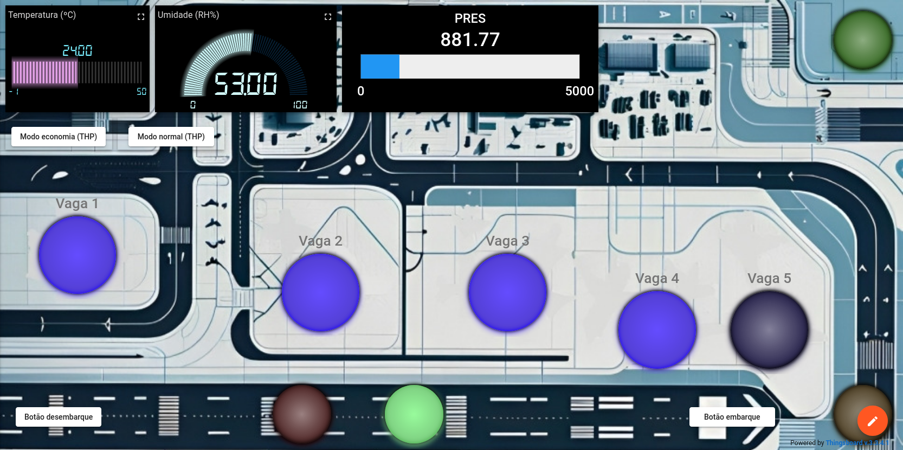
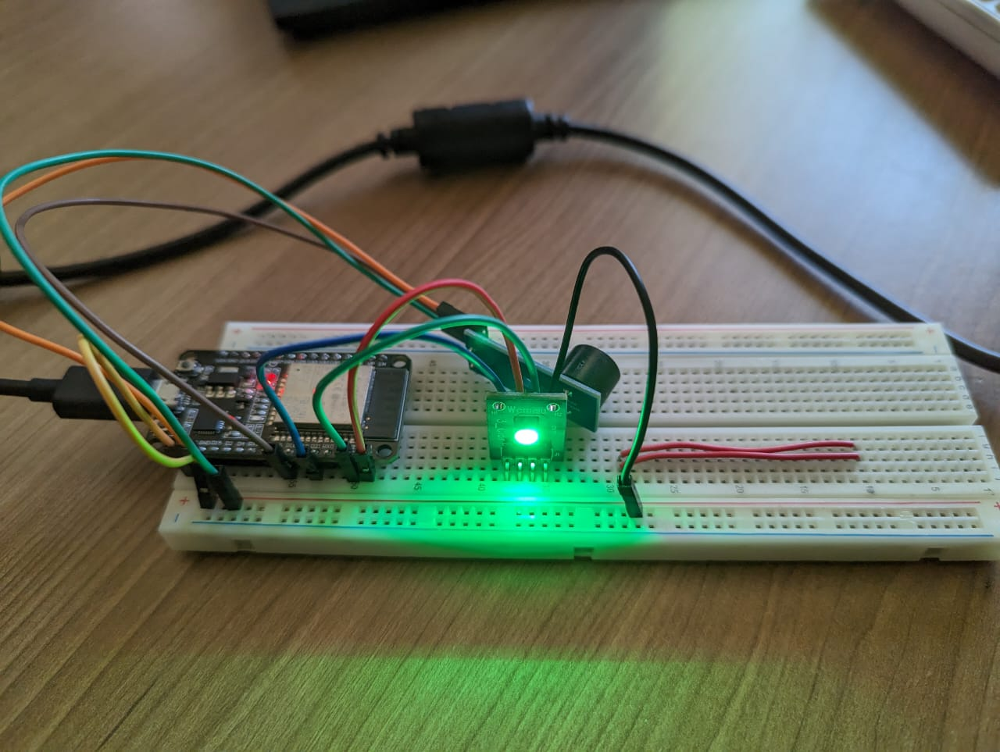
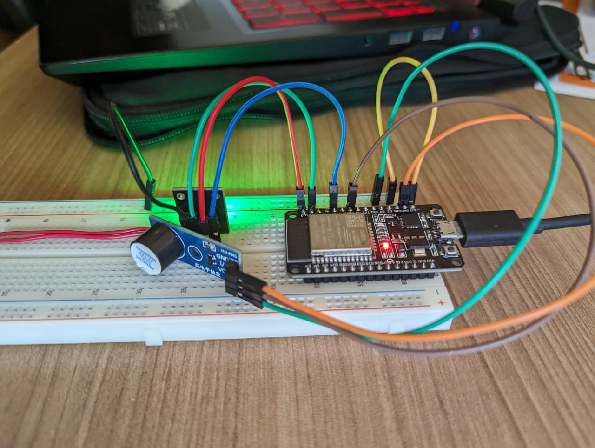
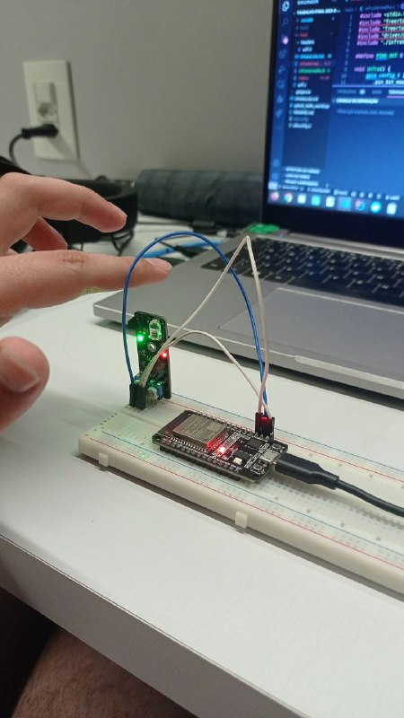
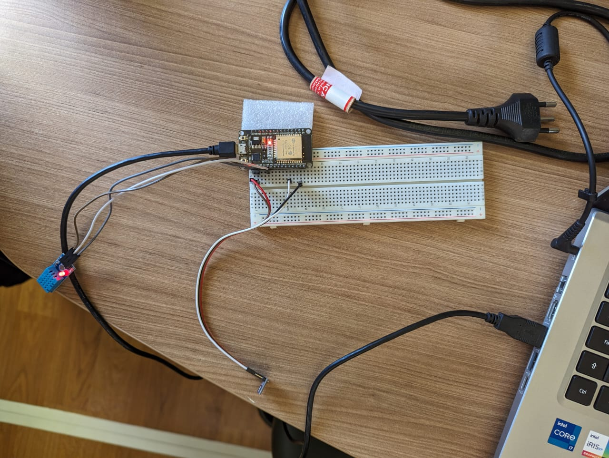

# Sistema de Gerenciamento de Aeroporto

## 1. Grupo

| Aluno                              | Matrícula  |
| ---------------------------------- | ---------- |
| Lucas Felipe Soares                | 202016767  |
| Andre Macedo Rodrigues Alves       | 190102390 |
| Paulo Henrique de Oliveira Rezende |190094257 |
|     Matheus Soares Arruda          | 190093480  |


## 2 Escopo do Projeto

O escopo geral escolhido pelo grupo para o terceiro trabalho da disciplina de Fundamentos de Sistemas Embarcados, corresponde ao semestre de 2023/2, foi fazer um sistema de controle de tráfego aéreo, representado na dashboard por um **aeroporto**. No contexto em questão, a ideia era controlar a quantidade de aviões presentes no aeroporto, verificar se há aviões pousando em uma situação na qual o aeroporto se encontra já sem vagas. Na imagem abaixo, veremos a dashboard elaborada pelo grupo para melhor contextualizar o projeto:



## 3. Sensores

### Led RGB



Utilizado para fazer o controle da pista de embarque e desembarque de aviões.
Quando o botão de embarque ou desembarque é acinado, o led fica na cor vermelha e
um timer de 10 segundo é contabilizado. Além disso, é no módulo `rgb_led` que 
o controle das vagas e a verificação da lotação do aeroporto são feitos.

### Buzzer



Utilizado para emitir sons que sinalizem que há aviões tentando pousar em um dado momento onde não cabem mais aviões no aeroporto ou caso o botão de desembarque seja acionado e não tenha nenhum avião naquele dado momento.

### Sensor Infravermelho 



Utilizado para verificar a presença de objetos, aviões no dado contexto, para que se possa verificar se há um avião tentando pousar em um momento de lotação.

### BMP e DHT11



Utilizado para a verificação de temperatura, umidade e pressão do ambiente. Além mais, das configurações atreladas aos modos de bateria.


## 4. Configurações Gerais

### Configurando a ESP-IDF

```bash
. $HOME/esp/esp-idf/export.sh
```

### Comandos de build

```bash
make build-all # compila todos os clientes 
```

```bash
make build-rgb # compila apenas o cliente rgb
```

```bash
make build-lcd_buzzer # compila apenas o cliente lcd_buzzer

```

```bash
make build-infra # compila apenas o cliente infra
```

```bash
make build-thp # compila apenas o cliente thp
```

### Comandos para rodar cada cliente

```bash
make run-rgb
```

```bash
make run-lcd_buzzer
```

```bash
make run-infra
```

```bash
make run-thp
```

### Limpando os arquivos de build

```bash
make clean-all
```

É possível limpar cada cliente separadamente também.

### Comandos úteis

```bash
idf.py -p /dev/ttyUSB0 build
idf.py -p /dev/ttyUSB0 flash
idf.py -p /dev/ttyUSB0 monitor
```

```bash
idf.py -p /dev/ttyUSB0 build flash monitor
```

```bash
idf.py clean
```

```bash
idf.py menuconfig
```

Parando o monitor
crtl + ]


### Para configurar o WIFI:

Entre em alguma das pastas, exemplo: `cd rgb_led` e
rode o seguinte comando:

idf.py menuconfig

Entrar na sessão "Example Connection Configuration"

Preencher os campos SSID e Password

SSID = Nome do seu WIfi
Password = Senha do WIFI
